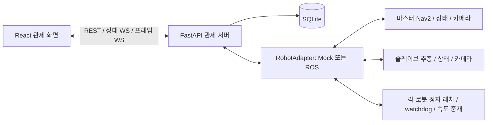

# 기능·인터페이스 명세서

관련 기준: [요구사항 정의서](01-requirements.md). 본 문서의 이름과 수치는 새 구현의 계약이다. 기존 ROS 코드가 이미 제공한다고 가정하지 않는다.

## 1. 화면과 상호작용

```text
┌ 연결 상태 / LIVE·MOCK / 로그인 사용자 / 제어권 / 전체 긴급정지 ┐
├─────────────────────────────────────┬─────────────────────┤
│ 공통 지도: 두 로봇·경로·목표·궤적    │ robot_1 상태 카드   │
│ 줌 / 전체 보기 / 로봇 따라보기       │ robot_2 상태 카드   │
│ 지도·라이다·costmap 레이어 선택      │ 편대 간격·상태      │
│                                     │ 임무 / 추종 제어    │
├──────────────────┬──────────────────┤ 개별 정지           │
│ 마스터 카메라     │ 슬레이브 카메라  │ 수동 조작           │
│ 이름·FPS·신선도   │ 이름·FPS·신선도  │                     │
├──────────────────┴──────────────────┴─────────────────────┤
│ 최신 경고 / 이벤트 타임라인 / 이력·설정으로 이동           │
└───────────────────────────────────────────────────────────┘
```

헤더는 고정한다. 본문 좌측 72%, 우측 28%; 지도 높이 기본 360px, 영상은 16:9. 작은 화면에서는 스크롤을 허용하며 지도 다음에 영상, 다음에 상세 패널을 배치한다. 화면에 맞추려고 지도를 읽기 어려울 만큼 축소하지 않는다.

- 지도 로봇 클릭과 영상 카드 선택은 같은 선택 상태를 공유한다. 마스터 청색, 슬레이브 주황색이며 역할 텍스트를 함께 표시한다.
- 지도에서 `시작점 설정` 또는 `도착점 설정` 모드를 선택한 뒤 클릭/드래그로 위치와 방향을 정한다. 단일 로봇 지도 주행은 선택 로봇의 시작점·방향과 도착점·방향을 모두 지정한 뒤 `시작점에서 도착점으로 이동` 버튼을 눌러야 요청된다. `위치 재설정(AMCL)`은 로봇을 들어 옮긴 뒤 정지 상태에서 시작점만 AMCL에 적용하고 지도 파일은 유지한다. 클릭만으로 즉시 주행하지 않으며, `설정 초기화`는 두 후보와 입력값을 지운다. 슬레이브 선택 상태라도 편대 임무 목표의 대상이 마스터임을 명시한다.
- 지도 셀 원점의 위치·회전을 적용해 world↔canvas 변환을 수행한다. 화면 y축 반전과 줌/팬의 역변환을 포함한다. 점유/미상 셀은 시작점·목표점·AMCL 위치 재설정 모두 지정 불가이며, 로봇 footprint 통과 가능성은 Nav2 결과로 판정한다.
- TF가 없으면 마지막 위치를 회색으로 남기고 경과 시간을 표시한다. TF 없는 두 위치로 상대 거리를 계산하지 않는다.
- 영상은 로봇별 독립 로딩·재연결. 2초간 새 프레임이 없으면 영상 위 `영상 지연/끊김` 오버레이, 5초 후 마지막 영상을 가린다. 다른 로봇 영상으로 대체하지 않는다.
- 확대 보기에도 선택 로봇 이름과 긴급정지 접근성을 유지한다.
- 설정과 로그는 별도 화면으로 제공하되 헤더 긴급정지는 유지한다.

## 2. 구조와 실행 방식



`backend/`에 Python 패키지 `pinky_control_center`를 두고 `frontend/`에 React 앱을 둔다. ROS 인터페이스 패키지 `pinky_control_interfaces`는 `ros/` 아래에 T12에서 추가한다. 기존 Flask 서버와 UI는 참고 자료로 유지한다. React·TypeScript·Vite, Python 3.12·FastAPI·rosbridge websocket client·SQLite를 기준으로 하고 실제 의존 버전은 T01에서 고정한다. 임의의 최신 버전을 문서에서 보장하지 않는다.

서버는 uvicorn worker 1개로 실행하며 로봇별 rosbridge websocket client가 각 ROS_DOMAIN_ID에 연결된다. 브라우저는 rosbridge에 직접 연결하지 않는다. 수신 콜백은 불변 스냅샷 또는 크기가 제한된 큐로 API 루프와 소통한다. 인코딩과 파일 쓰기는 별도 작업자에게 넘긴다. 제어 큐는 최대 100개, 초과 시 503 반환; 정지 요청은 일반 큐를 우회해 최신 래치 요청으로 우선 처리한다. 영상 큐는 로봇당 1개, 오래된 프레임은 버린다.

`CONTROL_MODE=mock|ros`로 어댑터를 선택한다. mock에서는 ROS import 없이 API와 UI를 실행할 수 있어야 한다. ROS 모드에서 연결 실패를 mock 데이터로 숨기지 않는다.

## 3. 데이터 계약

모든 REST 경로는 `/api/v1`, JSON 필드는 snake_case. 시간은 UTC ISO 8601, ID는 UUID 문자열(로봇 ID만 고정 문자열). 사용 불가 측정값은 null, 신선도는 `FRESH|STALE|UNKNOWN`. NaN/Infinity는 허용하지 않는다.

```typescript
type Pose = {x: number; y: number; yaw: number; frame_id: string};
type RobotState = {
  robot_id: string; name: string; role: 'MASTER'|'SLAVE';
  connection: 'ONLINE'|'STALE'|'OFFLINE'; received_at: string|null;
  pose: Pose|null; pose_freshness: 'FRESH'|'STALE'|'UNKNOWN';
  linear_mps: number|null; angular_rps: number|null;
  battery_percent: number|null; voltage_v: number|null;
  battery_freshness: 'FRESH'|'STALE'|'UNKNOWN';
  mode: 'IDLE'|'AUTO'|'FOLLOW'|'MANUAL'|'STOPPED'|'ERROR'|'UNKNOWN';
  stop_latched: boolean|null;
  capabilities: string[];
  sensors: {name:string; state:'OK'|'STALE'|'ERROR'|'UNSUPPORTED'; received_at:string|null}[];
};
type FormationState = {
  state: 'UNPAIRED'|'READY'|'FOLLOWING'|'PAUSED'|'LOST'|'REJOINING'|'STOPPED'|'ERROR'|'UNKNOWN';
  master_id: string; slave_id: string; target_distance_m: number;
  distance_m: number|null; gap_error_m: number|null; bearing_rad: number|null;
  reason_code: string|null; received_at: string|null;
};
type Command = {
  command_id: string; request_id: string; target: string;
  state: 'QUEUED'|'ACCEPTED'|'RUNNING'|'SUCCEEDED'|'REJECTED'|'FAILED'|'TIMED_OUT'|'CANCELED';
  reason_code: string|null; created_at: string; updated_at: string;
};
```

`distance_m`는 공통 좌표에서 로봇 기준점 간 유클리드 거리, `gap_error_m=distance_m-target_distance_m`. `bearing_rad`는 마스터의 전방 기준으로 본 슬레이브 방향(-π~π). 물리적 충돌 여유 거리는 footprint/센서 기반 로봇 판단이며 기준점 간격과 혼동하지 않는다. 휘어진 경로에서 목표 간격 오차만으로 추종 실패를 단정하지 않고 추종 노드 상태도 함께 사용한다.

`Mission`: mission_id, name, state, master_id, slave_id, map_id, waypoints(Pose[], 1~100), repeat_count(1~100), waypoint_index, lap_index, progress_distance_m(nullable), failure_code(nullable), created_at, updated_at.

`Alert`: alert_id, code, robot_id(nullable), mission_id(nullable), severity(INFO/WARNING/CRITICAL), state(ACTIVE/RESOLVED), acknowledged_at(nullable), acknowledged_by(nullable), first_seen_at, last_seen_at, occurrences, message.

## 4. 명령 및 상태 전이

### 4.1 공통 명령

제어 POST에는 `request_id`를 요구한다. 같은 사용자·request_id·동일 payload는 24시간 동안 기존 command_id를 반환한다. 같은 키에 다른 payload는 409. 응답 202는 접수이며 완료가 아니다. 결과는 `GET /commands/{id}`와 WS로 전달한다.

일반 명령은 2초 내 로봇 수락이 없으면 TIMED_OUT. 이후 늦은 응답은 기록·상태 재조정에만 쓰며 새 명령처럼 재실행하지 않는다. Nav2 실행 제한은 경유점당 120초(설정 가능); 실패 시 다음 지점으로 자동 건너뛰지 않는다. 로봇 재접속/서버 재시작 시 미완료 명령을 자동 재전송하지 않는다.

에러: `401 AUTH_REQUIRED`, `403 FORBIDDEN`, `409 CONTROL_CONFLICT|INVALID_STATE|STALE_VERSION`, `422 INVALID_VALUE`, `503 ROBOT_UNAVAILABLE|UNSUPPORTED|QUEUE_FULL`. 본문 `{error:{code,message,details},request_id}`. 알려진 로봇 ID 밖의 대상은 404. 로그에 사용자·대상·명령·결과를 남긴다.

### 4.2 편대와 임무

| 전이 | 조건/처리 |
|---|---|
| UNPAIRED → READY | pair; 두 로봇 연결·정지·같은 지도·유효한 TF·추종 준비 확인 |
| READY/PAUSED → FOLLOWING | start/resume; 먼저 슬레이브가 FOLLOW 준비 응답, 다음 마스터 목표 전송. 한쪽 거절 시 양쪽 중단 |
| FOLLOWING → PAUSED | pause; 마스터 goal 취소와 양쪽 정지 확인, 진행 지점 저장 |
| FOLLOWING → LOST | 추종 노드 LOST 또는 간격 초과 지속; 임무 PAUSING, 양쪽 정지 요청 |
| LOST → REJOINING → READY | 운영자 rejoin, 로봇 측 재합류 action 완료. 실패는 ERROR. 마스터는 정지 유지 |
| 임의 상태 → STOPPED | 긴급정지; 양쪽 래치. 미확인 응답은 별도 target 상태에 보존 |
| STOPPED → READY | 양쪽 건강·정지 확인, 명시적 래치 해제. 자동 임무 재개 없음 |
| READY/PAUSED/STOPPED → UNPAIRED | unpair; 두 로봇 정지 확인 후 추종 해제 |

임무: `DRAFT → READY → STARTING → RUNNING → SUCCEEDED`; 중간에 `PAUSING → PAUSED → STARTING`, `CANCELING → CANCELED`, 또는 `FAILED`. 시작 전 pair READY와 capabilities 검증. 마지막 마스터 goal 성공 후 슬레이브가 목표 간격 내 정지한 것을 확인해야 전체 성공이다. 10초 내 슬레이브 완료가 없으면 PAUSED 및 경고. 순찰은 지점 성공 후 다음 지점, 끝나면 회차 증가. 서버 재시작 시 진행 중 임무는 PAUSED, 명령 상태는 복구 필요 사유로 종료 처리한다.

### 4.3 정지·수동 조작

긴급정지는 UI 추가 확인창 없이 전송한다. 전체 응답은 로봇별 `REQUESTED|ACKNOWLEDGED|CONFIRMED|UNCONFIRMED`를 갖는다. CONFIRMED는 로봇 stop_latched=true와 신선한 odom에서 |v|<0.01m/s, |ω|<0.02rad/s가 0.5초 지속된 경우다. 이는 소프트웨어 관측 정지이며 물리 안전 인증이 아니다. 2초 무응답 시 UNCONFIRMED 경고를 유지한다.

편대 운용 중 한 로봇 개별 정지는 해당 로봇을 즉시 정지시키고 편대 임무를 일시정지하며 동료에도 보호 정지를 요청한다. 정지 해제는 정지와 별도 명령이다. 정지 해제 자체가 주행을 시작하지 않는다.

로봇 최종 출력은 `정지 래치 > watchdog > 유효한 수동 제어 > 활성 자율/추종` 우선순위로 중재한다. Nav2·추종·수동 제어가 최종 cmd_vel에 동시에 발행하지 않도록 로봇 담당이 remap한다. 기존 cmd_vel에 0을 한 번 발행하는 방식으로 대체하지 않는다.

제어권 lease는 3초, UI는 1초마다 갱신. 수동 패킷은 10Hz, 로봇의 수동 명령 만료는 300ms. 전체 원격 운용 heartbeat 만료는 1초이며 로봇 측에서 정지 래치한다. 브라우저 제어권 소실 시 서버는 편대를 정지시키고, 서버 자체 단절은 로봇 watchdog이 처리한다. 로그인 세션 만료는 그 세션이 현재 제어 lease를 소유한 경우에만 제어권 소실로 처리한다. 제어권을 보유하지 않은 과거 로그인 세션의 만료·정리는 현재 운용 중인 로봇을 정지시키지 않는다. 수동 제어 진입은 임무 PAUSED, 양쪽 정지 확인, 선택 로봇 모드 전환 응답 후 허용한다. 종료 시 IDLE이며 자동 추종 복귀 없음.

### 4.4 지도 주행·재현지화

`map_260905`는 현장 `map_260905.world`의 collision box를 rasterize한 정적 점유 지도다. 이 단일 로봇 시험 배포는 SLAM으로 지도를 다시 만들지 않고 `nav2_map_server`와 AMCL을 사용한다. 따라서 시험 중 로봇을 들어 임의 위치로 옮겨도 지도를 초기화하지 않는다. 바뀌는 것은 로봇의 추정 위치이며, 새 시작점을 AMCL에 다시 알려야 한다.

단일 로봇의 지도 주행 요청은 다음 순서를 따른다.

1. 선택 로봇의 제어권을 획득하고 로봇이 ONLINE/FRESH이며 정지한 상태인지 확인한다.
2. 지도에서 `시작점 설정`으로 실제 로봇을 둔 자유 셀과 방향을 지정한다.
3. 로봇을 들어 옮겼거나 위치가 의심되면 `위치 재설정(AMCL)`을 눌러 `/initialpose`만 발행한다. 이 복구 동작은 기존 map pose/TF의 FRESH 여부를 요구하지 않으며, 로봇 연결·정지·정지 속도 허용오차·편대/임무 안전 조건은 유지한다. Pinky Pro encoder의 정지 양자화 잡음을 반영해 `|linear| ≤ 0.01 m/s`, `|angular| ≤ 0.03 rad/s`를 정지로 판정한다. 이 단계는 주행을 시작하지 않는다.
4. 정지 래치가 걸려 있으면 운영자가 `정지 해제`를 명시적으로 수행한다. 정지 해제는 이전 목표를 재개하지 않는다.
5. `도착점 설정`으로 자유 셀과 방향을 지정하고 `시작점에서 도착점으로 이동`을 누른다.

서버는 활성 지도·map frame·점유 상태·로봇 신선도·정지·편대/임무 상태·`navigate` capability를 확인한다. 시작점 또는 도착점이 점유/미상 셀이면 `MAP_POINT_BLOCKED`로 거부한다. 수락된 요청은 시작점 `/initialpose` → `AUTO` 모드 → 로봇 watchdog의 `NavigateToPose` action 요청 순서로 실행된다. Nav2 controller/recovery 출력은 `/control/nav_velocity`로만 들어가고 watchdog만 최종 `/cmd_vel`을 발행한다. `stop`은 Nav2 goal을 취소하며, 통신 복구나 정지 해제 후 자동 재개하지 않는다.

관제 화면은 명령 거절·Nav2 실패·완료 시간 초과 같은 동작 오류를 backend 연결 장애와 구분해 표시한다. `fetch` 자체의 네트워크 실패일 때만 개발 구성의 backend/Vite proxy 확인 안내를 노출하며, 정상 HTTP 응답으로 전달된 오류에는 해당 안내를 덧붙이지 않는다.

실물 Pinky의 목표 도달 판정은 지도 클릭 목표와 실제 정지 위치 사이의 평면 거리가 0.08m 이내이고 방향 오차가 0.17rad(약 10도) 이내일 때 성공으로 본다. 이는 0.25m 기본 허용오차로 인해 목표 약 0.22m 전에 성공 처리된 robot_2 현장 결과를 반영한 값이다. 최종 위치 오차는 현장 시험에서 기록하며, 허용오차를 줄인 뒤 진동·시간 초과가 발생하면 제어기와 감속 설정을 함께 재조정한다.

AMCL이 `/initialpose`를 받은 뒤 `map→odom→base_footprint` TF를 발행하기까지는 수 초가 걸릴 수 있다. 관제는 initial pose의 stamp를 0으로 보내 최신 TF를 사용하게 한다. 정지 해제는 이 TF를 대신 만들지 않는다. robot_2 Nav2 session은 고정된 2초 타이머로 navigation lifecycle을 활성화하지 않고, 해당 TF가 확인될 때까지 lifecycle startup을 대기·재시도한다. TF가 확인되기 전에는 지도 주행 버튼을 비활성화하고, TF가 사라지거나 startup이 실패해도 goal을 전송하지 않는다. 비활성 버튼 아래에는 제어권·연결·정지·TF 등 충족되지 않은 조건을 구체적으로 표시한다.

Nav2 session은 navigation을 시작하기 전에 hardware bringup의 `/start_motor` 서비스를 호출해 SLLidar 스캔을 시작한다. `/scan`이 발행되지 않으면 AMCL과 map TF가 준비되지 않으므로 session을 명확한 오류로 종료하며, 라이다 publisher가 토픽에 등록된 것만으로 준비 완료로 간주하지 않는다.

지도 가장자리의 픽셀은 벽으로 rasterize될 수 있으므로 화면 우측 상단 모서리 자체를 시작점으로 사용하지 않는다. 실제 시작 위치와 일치하는 우측 상단 안쪽의 자유 셀을 클릭한다.

## 5. REST·실시간 API

| Method/경로 | 입력 | 출력/동작 |
|---|---|---|
| POST `/session` | username,password | HttpOnly SameSite 쿠키, 사용자·역할. TLS 운영 배포에서는 Secure |
| GET/DELETE `/session` | 없음 | 현재 사용자 / 로그아웃·lease 반납 |
| GET `/state` | 없음 | robots[],formation,active_mission,active_alerts[],mode,seq,server_time |
| POST `/control-lease` | request_id | lease_id,expires_at; 충돌은 409 |
| PATCH/DELETE `/control-lease/{id}` | request_id | 갱신/반납; 소유자만 |
| GET `/robots` | 없음 | 로봇 설정·capabilities 목록 |
| POST `/robots/{id}/initial-pose` | request_id,pose | 정지·편대 해제·유효한 지도 TF 상태에서 command |
| POST `/robots/{id}/localization-reset` | request_id,lease_id,map_id,pose | 선택 로봇이 연결되고 정지한 상태에서 `/initialpose`만 발행. 기존 pose/TF가 stale이어도 복구 가능. 정적 지도 유지, AMCL 추정 위치만 갱신 |
| POST `/robots/{id}/navigate` | request_id,lease_id,map_id,start_pose,goal | 자유 셀·상태·capability 검증 후 start pose → AUTO → Nav2 `NavigateToPose` 요청 |
| POST `/missions` | request_id,name,map_id,waypoints,repeat_count | DRAFT mission |
| GET `/missions` | cursor,limit(최대100),state,from,to | items,next_cursor |
| GET `/missions/{id}` | 없음 | Mission |
| PATCH `/missions/{id}` | request_id,version,name,waypoints,repeat_count | DRAFT/READY만 수정 |
| POST `/missions/{id}/actions` | request_id,action(validate/start/pause/resume/cancel) | command |
| POST `/formation/actions` | request_id,action(pair/start/pause/unpair/rejoin),master_id,slave_id | command; 단독 start는 추종 준비만 수행, 마스터 주행은 mission start |
| POST `/stop` | request_id,target(all/robot_1/robot_2) | command와 targets별 정지 확인 상태; lease 없이 운영자 이상 허용 |
| POST `/stop/reset` | request_id,target | 정지 래치 해제 command; lease 필요 |
| POST `/robots/{id}/mode` | request_id,mode(IDLE/MANUAL) | command |
| GET `/commands/{id}` | 없음 | Command, targets(전체 정지일 때) |
| GET `/maps` | 없음 | map_id,name,version 목록 |
| GET `/maps/{id}` | 없음 | frame_id,resolution,width,height,origin,version,data_url |
| GET `/maps/{id}/data` | version | PNG: free=254,occupied=0,unknown=205; ETag 캐시 |
| POST `/maps/actions` | request_id,action(select/save/reset),map_id 또는 name | 정지 상태 검사, command; reset에 confirm=true |
| GET `/alerts` | state,severity,robot_id,cursor,limit | items,next_cursor |
| POST `/alerts/{id}/ack` | request_id | 확인자/확인시각; 원인 해소 아님 |
| GET `/events` | robot_id,mission_id,from,to,cursor,limit | items,next_cursor |
| GET `/events/export` | 동일 필터,format(csv/json) | 다운로드; 최대 24시간 단위 |
| GET/PUT `/settings` | PUT:request_id,version,values | 설정 및 version; 관리자만 수정 |
| POST `/robots/{id}/accessories` | request_id,device(led/lamp/emotion),values | 장치별 스키마 검증 후 command |

PUT settings는 서버 로컬 설정과 로봇 적용을 구별한다. 로봇 적용 실패 시 활성 버전은 이전 값을 유지하고 실패 결과를 반환한다. 편대 양쪽에 영향을 주는 변경은 정지 상태에서만 수행하며 한쪽만 적용되면 편대 시작을 차단하고 기존 값 복원을 시도한다.

상태 WS `/ws/state`: `{type,seq,server_time,payload}`. type은 snapshot/robot_state/formation/mission/command/alert/camera_status. 최초 snapshot, 이후 상태 5Hz와 이벤트 즉시 전송. 클라이언트 sequence 누락 시 GET state 재동기화. 느린 클라이언트 큐 100개 초과 시 연결 종료 후 snapshot으로 복구, 명령 결과는 DB로 조회 가능.

수동 WS `/ws/teleop`: `{lease_id,robot_id,seq,linear_mps,angular_rps}`. mode·lease·증가 seq·상한 검증, 오래된 패킷 거부. 전송 timestamp 대신 서버 수신 monotonic 시간을 watchdog 기준으로 사용한다. 버튼 해제·입력 timeout은 선택 로봇에 0속도를 전달하고 정지 래치를 걸지 않는다. 웹소켓 연결 해제, lease 만료, 명시적 정지와 안전 경보는 별도의 보호 정지 래치를 적용한다.

영상 WS `/ws/cameras/{robot_id}`: 메시지 하나는 `4-byte big-endian 메타데이터 길이 + UTF-8 JSON + JPEG bytes`. 메타데이터는 `{frame_id,captured_at,received_at,width,height}`. 프런트엔드는 최신 프레임만 렌더링하고 기존 Blob URL 해제. 저화질 320×240/5FPS, 기본 640×480/10FPS, 고화질 1280×720/15FPS 요청을 query quality로 받되 원본보다 업스케일하지 않는다. 실제 달성 FPS와 촬영시각 유효성을 표시한다. reconnect backoff는 1/2/4/8초, 최대 8초.

## 6. ROS 연동 계약

두 로봇이 공통 map에서 위치 추정하는 구성을 기본으로 한다. 목표 TF는 `map → robot_1/odom → robot_1/base_footprint`, robot_2도 동일하다. 각 로봇 odom 좌표를 그대로 같은 지도 좌표로 간주하지 않는다. 서로 다른 map을 쓰는 경우 보정된 map transform이 제공될 때까지 편대 시작을 차단한다.

로봇마다 서로 다른 ROS_DOMAIN_ID와 rosbridge websocket endpoint를 사용한다. 배포 고정값은 `robot_1=12`, `robot_2=13`이며 관제 UI/API의 domain 변경 기능은 제공하지 않는다. bridge URL, credentials/TLS, topic/service/action 및 compressed camera mapping은 `backend/config/robots.yaml`에 저장한다. rosbridge 단절은 reconnect backoff와 STALE/OFFLINE 전이로 표시한다. 고정 프레임을 쓰는 기존 bringup은 로봇 담당과 검증한다.

실물 Pinky bringup이 namespace 없는 전역 토픽을 발행하는 경우에도 로봇별 rosbridge endpoint가 domain 격리 경계이므로, 배포 매핑은 `/odom`, `/battery/percent`, `/battery/voltage`, `/tf`, `/tf_static`, `/initialpose`, `/control/manual_velocity` 같은 전역 이름을 사용할 수 있다. 시뮬레이터 또는 namespace를 제공하는 로봇은 해당 환경의 매핑을 사용한다.

| 입력/출력 | 목표 이름 (`{ns}`는 로봇 namespace) | 타입/처리 |
|---|---|---|
| 입력 | `/map`, `/tf`, `/tf_static` | OccupancyGrid, TFMessage. 지도 reliable/transient_local, 동적 TF 기본 tf2 정책 |
| 입력 | `{ns}/odom`, `{ns}/scan` | Odometry, LaserScan. 센서 best_effort/volatile을 기본으로 발행자 호환 확인 |
| 입력 | `{ns}/battery/percent`, `battery/voltage` | Float32. percent 값 범위를 실측해 0~100으로 정규화 |
| 입력 | 설정한 compressed image 토픽 | 실물 Pinky는 `/camera/front` raw `Image`를 발행하고, 로봇 세션 런처가 `/camera/image_raw/compressed` `CompressedImage`로 변환한 토픽을 rosbridge JSON/base64로 전달한다. 관제는 이를 JPEG로 변환하며 quality/throttle/fragment를 설정하고 별도 binary gateway는 옵션이다. |
| 입력 | `{ns}/plan`, `local_costmap/costmap`, `global_costmap/costmap` | Path 및 실제 발행 타입에 맞춘 OccupancyGrid/Costmap 어댑터 |
| 제어 | `{ns}/navigate_to_pose` | NavigateToPose action. 로봇 watchdog가 자체 goal handle을 추적·취소하고 ControlStatus에 capability/상태를 보고 |
| 제어 | 설정한 initial pose 토픽 (실물 Pinky: `/initialpose`) | PoseWithCovarianceStamped, 정지 시 허용 |
| 제어 | `{ns}/set_led`, `{ns}/set_lamp` | 기존 pinky_interfaces 서비스 정의를 읽고 필드 매핑 |
| 신규 입력 | `{ns}/control/status` | 아래 ControlStatus, 10Hz heartbeat |
| 신규 제어 | `{ns}/control/command` | 아래 ControlCommand service, reliable, 2초 수락 제한 |
| 신규 출력 | `{ns}/control/nav_velocity` | Twist. Nav2 controller/recovery의 입력을 watchdog로 중계하며 최종 `/cmd_vel` 직접 발행 금지 |
| 신규 입력 | `{slave_ns}/follow/status` | 아래 FollowStatus, 5Hz |
| 신규 제어 | `{slave_ns}/follow/command` | 아래 FollowCommand service; 장기 완료는 status command_id로 상관 |
| 신규 출력 | `{ns}/control/manual_velocity` | TwistStamped, 10Hz. 최종 cmd_vel에 직접 발행 금지 |
| 신규 출력 | `{ns}/control/heartbeat` | std_msgs/UInt64, 10Hz 증가 counter; 수신 간격으로 watchdog 판단 |

현재 rosbridge adapter는 `/tf`·`/tf_static`의 `TFMessage`와 odom을 로봇별로 수신하고, TF graph를 합성해 `map` 기준 pose를 만든다. 지도 TF 경로가 없으면 pose는 `tf_valid=false`, `MAP_TF_UNVERIFIED`로 유지한다. 초기 위치 API와 지도 주행은 설정한 initial pose 토픽(실물 Pinky는 `/initialpose`)에 stamp 0의 `PoseWithCovarianceStamped`를 발행해 최신 TF를 사용한다. 지도 주행 실행기는 start pose를 먼저 발행하고 `AUTO` 모드와 `navigate` ControlCommand를 순서대로 요청한다. 실물 robot_2의 watchdog는 이 명령을 `/navigate_to_pose` action으로 연결하며 Nav2 출력은 `/control/nav_velocity`로 받고 최종 `/cmd_vel`을 단독 발행한다. 현재 API 입력에는 covariance를 받지 않고 36개 0값을 사용한다. 수동 WS 입력은 검증 후 설정한 중재 토픽(실물 Pinky는 `/control/manual_velocity`)에 `TwistStamped`를 발행한다. 이 동작은 adapter contract test로 검증했지만 실제 ROS graph·QoS·AMCL 초기화·Nav2 action·안전 중재기는 현장 gate에서 별도 확인한다.

신규 인터페이스는 `pinky_control_interfaces`에서 아래 필드로 정의한다. 로봇 팀이 이미 다른 인터페이스를 제공하면 타입·명령 ID·완료 확인 의미를 보존하는 어댑터를 구현한다.

```text
# msg/ControlStatus.msg
builtin_interfaces/Time stamp
string robot_id
string mode
bool stop_latched
string active_command_id
string command_state
string reason_code
string[] capabilities
float64 linear_mps
float64 angular_rps

# srv/ControlCommand.srv
string command_id
string operation
string parameters_json
---
bool accepted
string reason_code

# msg/FollowStatus.msg
builtin_interfaces/Time stamp
string command_id
string state
string reason_code
float64 distance_m
float64 gap_error_m
bool measurement_valid

# srv/FollowCommand.srv
string command_id
string operation
string master_id
float64 target_distance_m
---
bool accepted
string reason_code
```

ControlCommand operation은 stop/reset_stop/set_mode/apply_settings/navigate/cancel_navigation을 허용하고 parameters_json은 operation별 스키마 검증한다. set_mode는 mode, apply_settings는 version/values, stop/reset_stop/cancel_navigation은 빈 객체 또는 취소 사유, navigate는 goal/map_id/navigation_id를 받는다. FollowCommand operation은 pair/start/pause/unpair/rejoin. 서비스 accepted는 수락일 뿐이며 ControlStatus/FollowStatus가 완료를 확인한다. `navigate`의 accepted는 Nav2 목표 요청 접수이며 최종 action 결과와 진행 상태는 로봇 ControlStatus에 남긴다. 거리 미측정은 measurement_valid=false로 제공한다. 양쪽 서버는 command_id 중복을 실행하지 않는다.

실물 Pinky의 안전 중재 구현은 `ros/pinky_control_watchdog` 패키지다. 시작 시 정지 래치를 걸고, `reset_stop`은 자동 재개 없이 IDLE로만 전환한다. `set_mode: MANUAL` 이후에만 `TwistStamped` 수동 입력을 허용하며, 입력이 0.35초 이상 끊기면 `/cmd_vel`에 0을 계속 발행한다. 선속도·각속도는 각각 0.15m/s·0.50rad/s로 한 번 더 제한한다. `AUTO`·`FOLLOW` 입력은 `/control/nav_velocity`에서 받되 Nav2 연결 전에는 사용하지 않는다. `navigate`는 `NavigateToPose` action server가 준비된 경우에만 수락하고, stop/reset_stop/cancel_navigation 시 활성 goal을 취소하며 자동 재개하지 않는다. `/cmd_vel`에는 이 중재기만 연결하고 관제 adapter는 직접 발행하지 않는다.

필수 노드 감시는 ROS graph 존재 확인과 control heartbeat를 나란히 제공한다. 그래프에 노드가 존재한다고 정상 실행으로 판정하지 않는다. 센서 stale도 분리한다. 센서 시간/수신 시각/monotonic watchdog 시간을 혼합하지 않는다. 시뮬레이션 ROS time 정지는 데이터 stale로 표시하고 watchdog은 wall monotonic으로 유지한다.

## 7. 초기 설정·경고 정책

| 설정 | 기본값 | 검증/동작 |
|---|---|---|
| target_distance_m | 0.8 | 0.5~2.0; 로봇 footprint 시험 후 조정 |
| gap_tolerance_m | 0.2 | 0.05~0.5 |
| separation_limit_m | 1.5 | target+tolerance보다 큼; 2초 초과면 LOST·편대 정지 |
| close_limit_m | 0.35 | target-tolerance보다 작음; 0.3초 미만 간격 지속 시 정지 요청 |
| max_linear_mps / max_angular_rps | 0.15 / 0.5 | 하드웨어에서 제공한 상한 이하; 실물 상한 미확인이면 이동 제어 비활성 |
| battery_warning_percent | 20 | 10초 지속 경고, 25 초과 10초 시 해소 |
| battery_critical_percent | 10 | 10초 지속 편대 정지 요청; stale 값으로 판정 금지 |
| heartbeat_stale/offline_s | 1 / 3 | stale면 새 주행 금지·정지 요청, offline 경고 |

추종 ERROR, TF stale, 필수 주행 센서 ERROR는 편대 정지 정책. 카메라 끊김은 WARNING이며 영상만 끊겼다고 로봇을 무조건 멈추지 않는다. 영상 의존 수동 운용에서는 끊긴 로봇 수동 입력을 차단한다. 장애물 알림은 로봇 측 차단 상태/이유를 표시하며 관제 라이다 점 하나로 충돌 판단하지 않는다.

동일 code+robot_id의 활성 알림은 하나로 유지하며 occurrences와 last_seen 갱신. 확인(ACK)은 소리만 억제하고 원인 해소를 대신하지 않는다. 일반 센서 경고는 정상 3초 유지 시 해소. 알림 팝업은 긴급정지 버튼을 가리지 않는다.

## 8. 저장·운영

SQLite WAL, schema migration version을 둔다. 테이블: users(id,username,password_hash,role), robots(id,config_json), missions(id,state,payload_json,created_at,updated_at), commands(id,request_id,user_id,payload_hash,target,state,payload_json,result_json,created_at,updated_at), events(id,robot_id,mission_id,kind,payload_json,recorded_at), alerts(id,code,robot_id,state,payload_json), telemetry(id,robot_id,mission_id,source_at,received_at,payload_json), settings(version,values_json,applied_at). commands에 (user_id,request_id) unique, 조회 필터의 mission_id/robot_id/time index를 만든다.

위치·편대 telemetry는 필요한 운용 이력 범위에서 저장하고 배터리는 수신 시, 이벤트·명령은 전량 저장한다. 카메라는 T04의 실시간 스트림만 제공하며 JPEG 파일 녹화, 프레임 인덱스, 동기 재생 API는 구현하지 않는다.

운영 환경은 정적 UI와 API를 같은 출처의 TLS 리버스 프록시로 노출하고 ROS DDS는 내부 LAN으로 제한한다. 제어 POST는 CSRF 토큰과 Origin 검증, WS는 세션·Origin 검증. 로그인은 사용자/IP별 5회/분 제한. 비밀번호는 검증된 해시 라이브러리 사용, 기본 하드코딩 계정은 금지한다. 시스템 서비스 재시작은 상태 조회를 복구할 뿐 주행을 재개하지 않는다.
